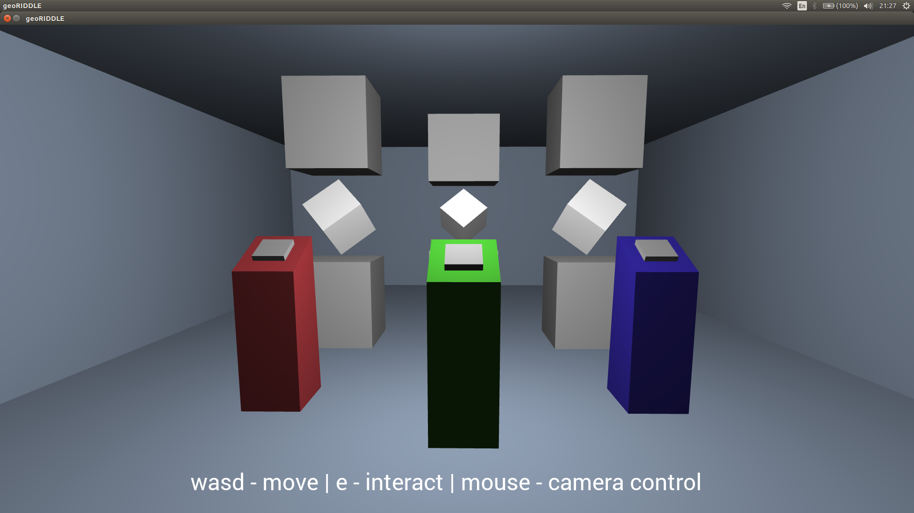
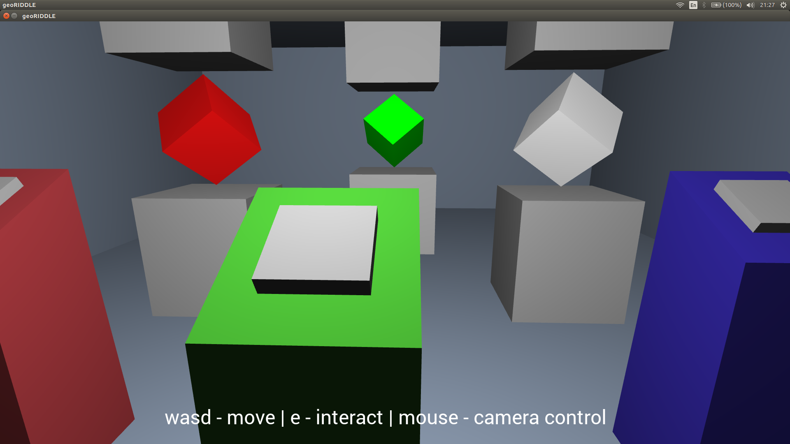
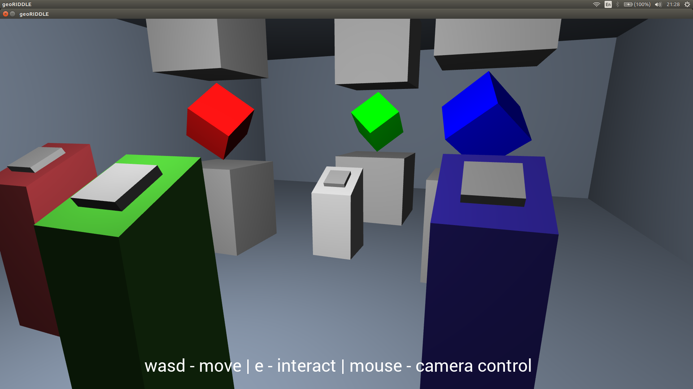

# Geoengine (3d game engine)

This repository contains:
* A 3D game engine made with C++ and OpenGL created with learning intent
* Small puzzle game made with GeoEngine as proof of concept

GeoEngine features:
* Dynamic objects with customizable logic and object dependency system
* Interactive objects that supports input from user
* FPS camera that can interact with world
* User input

Rendering pipeline supports:
* Importing 3d models in .obj format
* Texturing
* Dynamic lightning using Phong model
* Free 3D camera
* Text rendering

## Gameplay screenshots:

